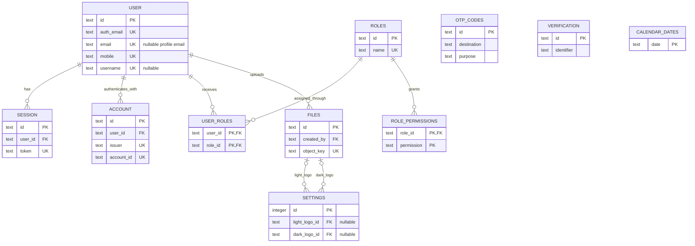

# Database schema

This document is the human-readable reference for the Kernel SQLite database.
The executable source of truth is `server/src/db/schema.ts`; versioned changes
are applied by the SQL migrations in `server/drizzle`.

## Conventions

- Independent entities use text identifiers suitable for UUIDs. Kernel-owned
  identifiers are currently generated with `crypto.randomUUID()`.
- Join tables use composite primary keys when the relationship itself is the
  identity of the row.
- SQLite stores booleans and timestamps as integers; Drizzle maps them to
  TypeScript `boolean` and `Date` values.
- Better Auth owns authentication records. Kernel owns domain roles,
  permissions, settings, calendar dates, OTP challenges, and file metadata.
- Object bytes are stored by the selected local-filesystem or MinIO adapter.
  The database stores only object metadata and references.

## Entity relationships



`UK` means a unique key. The uniqueness of `ACCOUNT` is the compound key
`(issuer, account_id)`, rather than either column individually.

## Better Auth tables

### `user`

Stores the authenticated identity and Kernel profile fields.

| Column             | Drizzle type      | Null | Key/default      | Purpose                                      |
| ------------------ | ----------------- | ---- | ---------------- | -------------------------------------------- |
| `id`               | text              | no   | PK               | User identifier                              |
| `auth_email`       | text              | no   | unique           | Internal email-shaped Better Auth identifier |
| `email`            | text              | yes  | unique           | Verified, user-visible profile email         |
| `email_verified`   | integer/boolean   | no   | default `false`  | Better Auth core verification flag           |
| `mobile`           | text              | no   | unique           | Product login identifier                     |
| `username`         | text              | yes  | unique           | Optional normalized username                 |
| `display_username` | text              | yes  | —                | Optional displayed username                  |
| `first_name`       | text              | no   | —                | Given name                                   |
| `last_name`        | text              | no   | —                | Family name                                  |
| `name`             | text              | no   | —                | Full name used by Better Auth                |
| `image`            | text              | yes  | —                | Optional profile image reference             |
| `status`           | text              | no   | default `active` | `active` or `inactive`                       |
| `is_system_admin`  | integer/boolean   | no   | default `false`  | Bypasses domain permission checks            |
| `created_at`       | integer/timestamp | no   | generated        | Creation time                                |
| `updated_at`       | integer/timestamp | no   | generated        | Last update time                             |

The internal `auth_email` exists because Better Auth's credential flow requires
an email-shaped identity even for mobile-first accounts. It is not exposed as
the user's email. The profile `email` remains `NULL` until a user verifies one.

### `session`

| Column       | Drizzle type      | Null | Key/default    | Purpose                           |
| ------------ | ----------------- | ---- | -------------- | --------------------------------- |
| `id`         | text              | no   | PK             | Session identifier                |
| `user_id`    | text              | no   | FK → `user.id` | Session owner                     |
| `token`      | text              | no   | unique         | Session credential                |
| `expires_at` | integer/timestamp | no   | —              | Expiry time                       |
| `ip_address` | text              | yes  | —              | Source address when available     |
| `user_agent` | text              | yes  | —              | Client description when available |
| `created_at` | integer/timestamp | no   | —              | Creation time                     |
| `updated_at` | integer/timestamp | no   | —              | Last update time                  |

Deleting a user cascades to its sessions.

### `account`

| Column                     | Drizzle type      | Null | Key/default     | Purpose                               |
| -------------------------- | ----------------- | ---- | --------------- | ------------------------------------- |
| `id`                       | text              | no   | PK              | Authentication account identifier     |
| `user_id`                  | text              | no   | FK → `user.id`  | Owning user                           |
| `issuer`                   | text              | no   | compound unique | Identity namespace                    |
| `account_id`               | text              | no   | compound unique | Identity within the issuer            |
| `provider_id`              | text              | no   | —               | Credential or external provider       |
| `password`                 | text              | yes  | —               | Password hash for credential accounts |
| `access_token`             | text              | yes  | —               | Provider access token                 |
| `refresh_token`            | text              | yes  | —               | Provider refresh token                |
| `id_token`                 | text              | yes  | —               | Provider identity token               |
| `scope`                    | text              | yes  | —               | Granted provider scopes               |
| `access_token_expires_at`  | integer/timestamp | yes  | —               | Access-token expiry                   |
| `refresh_token_expires_at` | integer/timestamp | yes  | —               | Refresh-token expiry                  |
| `created_at`               | integer/timestamp | no   | —               | Creation time                         |
| `updated_at`               | integer/timestamp | no   | —               | Last update time                      |

The unique constraint covers `(issuer, account_id)`. Deleting a user cascades
to its accounts.

### `verification`

| Column       | Drizzle type      | Null | Key/default | Purpose                        |
| ------------ | ----------------- | ---- | ----------- | ------------------------------ |
| `id`         | text              | no   | PK          | Verification identifier        |
| `identifier` | text              | no   | indexed     | Subject being verified         |
| `value`      | text              | no   | —           | Better Auth verification value |
| `expires_at` | integer/timestamp | no   | —           | Expiry time                    |
| `created_at` | integer/timestamp | yes  | —           | Creation time                  |
| `updated_at` | integer/timestamp | yes  | —           | Last update time               |

## Authorization tables

### `roles`

| Column | Drizzle type | Null | Key/default | Purpose         |
| ------ | ------------ | ---- | ----------- | --------------- |
| `id`   | text         | no   | PK          | Role identifier |
| `name` | text         | no   | unique      | Display name    |

### `role_permissions`

| Column       | Drizzle type | Null | Key/default         | Purpose               |
| ------------ | ------------ | ---- | ------------------- | --------------------- |
| `role_id`    | text         | no   | PK, FK → `roles.id` | Owning role           |
| `permission` | text         | no   | PK                  | Domain permission key |

The composite primary key is `(role_id, permission)`. Deleting a role cascades
to its permission rows.

### `user_roles`

| Column    | Drizzle type | Null | Key/default         | Purpose       |
| --------- | ------------ | ---- | ------------------- | ------------- |
| `user_id` | text         | no   | PK, FK → `user.id`  | Assigned user |
| `role_id` | text         | no   | PK, FK → `roles.id` | Assigned role |

The composite primary key is `(user_id, role_id)`. Deleting a user cascades to
its assignments. Deleting a role with assignments is restricted.

## Application tables

### `files`

| Column          | Drizzle type      | Null | Key/default    | Purpose                  |
| --------------- | ----------------- | ---- | -------------- | ------------------------ |
| `id`            | text              | no   | PK             | File metadata identifier |
| `bucket`        | text              | no   | —              | Storage bucket/directory |
| `object_key`    | text              | no   | unique         | Storage object key       |
| `original_name` | text              | no   | —              | Uploaded filename        |
| `content_type`  | text              | no   | —              | MIME type                |
| `size`          | integer           | no   | —              | Byte length              |
| `visibility`    | text              | no   | —              | `public` or `private`    |
| `created_by`    | text              | no   | FK → `user.id` | Uploading user           |
| `created_at`    | integer/timestamp | no   | —              | Upload time              |

Deleting the uploader is restricted while file metadata refers to that user.
Deleting metadata does not implicitly delete the stored object; object lifecycle
must be handled deliberately by application logic.

### `settings`

| Column          | Drizzle type | Null | Key/default     | Purpose                             |
| --------------- | ------------ | ---- | --------------- | ----------------------------------- |
| `id`            | integer      | no   | PK              | Singleton identifier, currently `1` |
| `language_code` | text         | no   | —               | Active language                     |
| `light_theme`   | text         | no   | —               | Serialized light-theme settings     |
| `dark_theme`    | text         | no   | —               | Serialized dark-theme settings      |
| `light_logo_id` | text         | yes  | FK → `files.id` | Public light logo                   |
| `dark_logo_id`  | text         | yes  | FK → `files.id` | Public dark logo                    |

Deleting a referenced logo sets the corresponding setting to `NULL`.

### `otp_codes`

| Column        | Drizzle type      | Null | Key/default    | Purpose                                             |
| ------------- | ----------------- | ---- | -------------- | --------------------------------------------------- |
| `id`          | text              | no   | PK             | OTP challenge identifier                            |
| `destination` | text              | no   | compound index | Mobile number or email destination                  |
| `purpose`     | text              | no   | compound index | Login, registration, reset, or verification purpose |
| `subject`     | text              | yes  | compound index | Account binding for authenticated OTP flows         |
| `value_hash`  | text              | no   | —              | Hash of the OTP, never the plaintext code           |
| `created_at`  | integer/timestamp | no   | —              | Issue time                                          |
| `expires_at`  | integer/timestamp | no   | —              | Expiry time                                         |
| `consumed_at` | integer/timestamp | yes  | —              | Successful consumption time                         |

### `calendar_dates`

| Column | Drizzle type | Null | Key/default | Purpose           |
| ------ | ------------ | ---- | ----------- | ----------------- |
| `date` | text         | no   | PK          | ISO calendar date |

The date is a natural key; a separate UUID would not add identity information.

## Foreign keys and delete behavior

| Child column               | Parent column | On delete |
| -------------------------- | ------------- | --------- |
| `session.user_id`          | `user.id`     | cascade   |
| `account.user_id`          | `user.id`     | cascade   |
| `user_roles.user_id`       | `user.id`     | cascade   |
| `user_roles.role_id`       | `roles.id`    | restrict  |
| `role_permissions.role_id` | `roles.id`    | cascade   |
| `files.created_by`         | `user.id`     | restrict  |
| `settings.light_logo_id`   | `files.id`    | set null  |
| `settings.dark_logo_id`    | `files.id`    | set null  |

## Indexes and unique constraints

| Table              | Columns                         | Kind       | Supports                                        |
| ------------------ | ------------------------------- | ---------- | ----------------------------------------------- |
| `user`             | `id`                            | primary    | Lookup by user ID                               |
| `user`             | `auth_email`                    | unique     | Better Auth identity lookup                     |
| `user`             | `email`                         | unique     | Optional profile-email lookup and uniqueness    |
| `user`             | `mobile`                        | unique     | Login and exact mobile lookup                   |
| `user`             | `username`                      | unique     | Username lookup and uniqueness                  |
| `session`          | `id`                            | primary    | Lookup by session ID                            |
| `session`          | `token`                         | unique     | Authentication by token                         |
| `session`          | `user_id`                       | non-unique | Sessions belonging to a user                    |
| `account`          | `id`                            | primary    | Lookup by account ID                            |
| `account`          | `user_id`                       | non-unique | Accounts belonging to a user                    |
| `account`          | `issuer, account_id`            | unique     | Provider-scoped account identity                |
| `verification`     | `id`                            | primary    | Lookup by verification ID                       |
| `verification`     | `identifier`                    | non-unique | Latest verification for a subject               |
| `roles`            | `id`                            | primary    | Lookup by role ID                               |
| `roles`            | `name`                          | unique     | Role-name uniqueness                            |
| `role_permissions` | `role_id, permission`           | primary    | Permissions of a role and duplicate prevention  |
| `user_roles`       | `user_id, role_id`              | primary    | Roles of a user and duplicate prevention        |
| `files`            | `id`                            | primary    | Lookup by file ID                               |
| `files`            | `object_key`                    | unique     | Storage object reference                        |
| `settings`         | `id`                            | primary    | Singleton lookup                                |
| `otp_codes`        | `id`                            | primary    | Lookup by challenge ID                          |
| `otp_codes`        | `destination, purpose, subject` | non-unique | Latest challenge for a flow and account binding |
| `calendar_dates`   | `date`                          | primary    | Lookup and uniqueness by date                   |

Primary keys and unique constraints create indexes in SQLite. Add another index
only for an observed query pattern; every index improves selected reads but adds
storage and write cost. Likely future candidates are `user_roles.role_id`,
`files.created_by`, `session.expires_at`, and `otp_codes.expires_at` if reverse
role lookup, owner file listing, or expiry cleanup becomes frequent.

## Changing the schema

1. Update `server/src/db/schema.ts`.
2. Generate a named migration:

   ```bash
   npm run server:generate -- --name descriptive_name
   ```

3. Review the generated SQL, especially table rebuilds, data copying, foreign
   keys, and destructive operations.
4. Update this document when columns, relationships, constraints, indexes, or
   ownership change.
5. Run `npm run server:test`; tests create a temporary SQLite database and apply
   the complete migration history.

Never edit an already deployed migration. Add a new migration so existing
databases can move forward safely.
